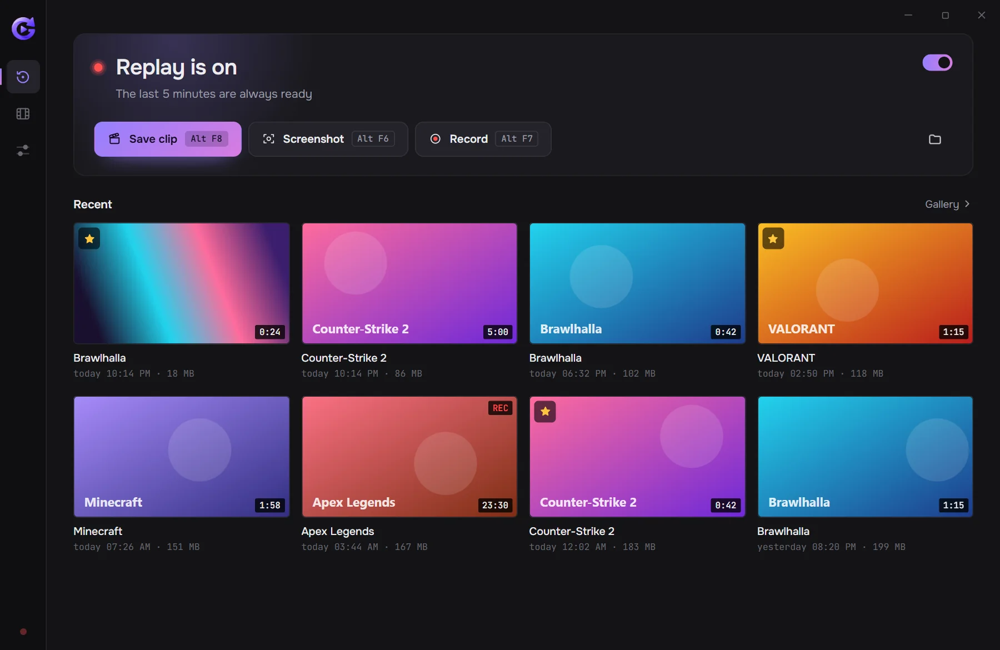
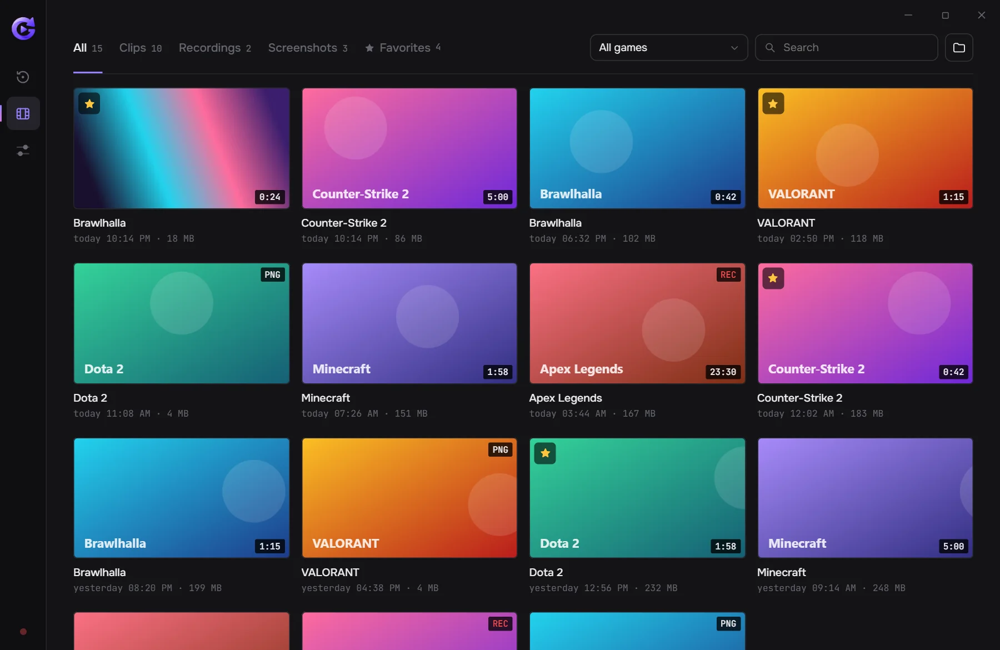
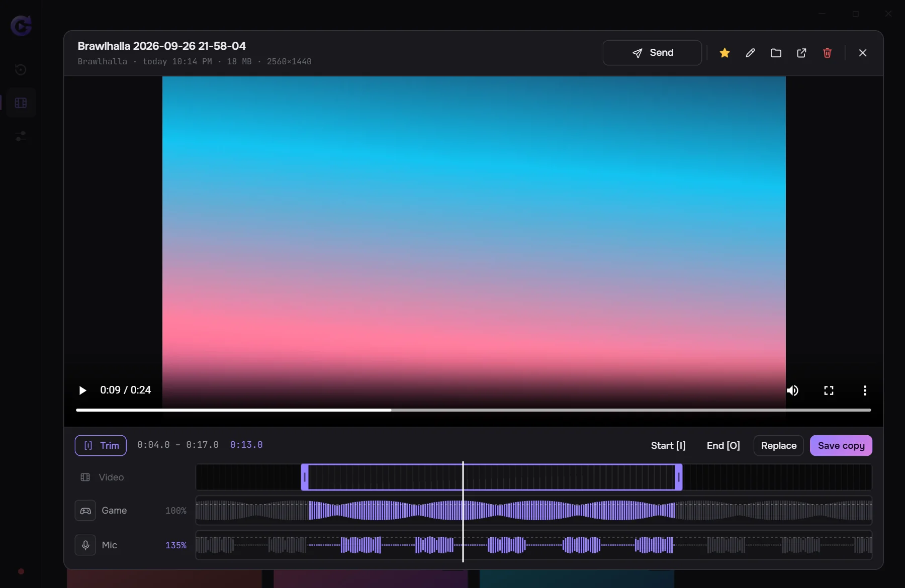

  

<h1 align="center">GeniusClip</h1>

  Instant replay for Windows. The last minutes of your game are always kept in memory — 
  press <kbd>Alt</kbd> + <kbd>F8</kbd> and they are saved as a clip.

  

  
  
  

  <a href="https://gandalfdark.github.io">Website</a> ·
  <a href="https://github.com/GandalfDark/geniusclip">Source code</a> ·
  <a href="https://github.com/GandalfDark/geniusclip-releases/releases">Changelog</a> ·
  <a href="https://github.com/GandalfDark/geniusclip/issues">Report a problem</a>

 

  

## What it does

- **Instant replay.** GeniusClip records in the background all the time. When something good happens, press <kbd>Alt</kbd> + <kbd>F8</kbd> and the last minutes are saved as a clip — you never have to remember to hit record. You choose how much to keep, up to an hour.
- **Screenshots and recordings.** <kbd>Alt</kbd> + <kbd>F6</kbd> takes a screenshot, <kbd>Alt</kbd> + <kbd>F7</kbd> starts and stops a regular recording.
- **In-game menu.** <kbd>Alt</kbd> + <kbd>X</kbd> opens a menu over the game with your latest clips, a player and quick settings. It is a separate window and nothing is injected into the game, so it is safe with anti-cheat.
- **Light on your PC.** The video is encoded by your NVIDIA, AMD or Intel graphics, so your frame rate barely changes. Frames where nothing moved aren't encoded again.
- **Clean sound.** Game and microphone are saved as separate tracks. Optional noise suppression removes keyboard clicks and fan hum from your mic.
- **Gallery and trimming.** Clips are sorted by game, with search and favorites. Cut what you don't need and set the game and mic volume separately.
- **Easy to share.** *Send* copies a clip, so you can paste it into Discord or Telegram with <kbd>Ctrl</kbd> + <kbd>V</kbd>.
- **14 languages**, updates in one click. No account, no ads, no telemetry.

<table>
  <tr>
    <td width="50%"></td>
    <td width="50%"></td>
  </tr>
  <tr>
    <td align="center">Gallery: every clip by game, with search and favorites</td>
    <td align="center">Trim: cut the clip and set each track's volume</td>
  </tr>
</table>

## Install

1. Download **[GeniusClip-Setup.exe](https://github.com/GandalfDark/geniusclip-releases/releases/latest/download/GeniusClip-Setup.exe)**.
2. Run it. If Windows shows *"Windows protected your PC"*, click **More info → Run anyway**. The installer isn't code-signed yet, so Windows doesn't recognize it ([why](#is-it-safe)).
3. Click **Install**, then **Launch GeniusClip**. From then on the replay is kept while the app runs; it waits in the tray and can start with Windows.

No administrator rights are needed. Updates come by themselves: the app offers a new version when one is out and installs it in one click.

> [!NOTE]
> Every release also contains `GeniusClip-x.y.z-update.exe` and `latest.json`. They are used by the built-in updater — you only need `GeniusClip-Setup.exe`.

## Hotkeys

| Action | Default |
| --- | --- |
| Save the replay as a clip | <kbd>Alt</kbd> + <kbd>F8</kbd> |
| Take a screenshot | <kbd>Alt</kbd> + <kbd>F6</kbd> |
| Start / stop recording | <kbd>Alt</kbd> + <kbd>F7</kbd> |
| Turn the replay on / off | <kbd>Alt</kbd> + <kbd>Shift</kbd> + <kbd>F8</kbd> |
| Open the in-game menu | <kbd>Alt</kbd> + <kbd>X</kbd> |

Any of them can be changed in Settings, including single keys like <kbd>F9</kbd> or <kbd>Num \*</kbd>.

## Requirements

- Windows 10 or 11, 64-bit
- Graphics that can encode video: NVIDIA (NVENC), AMD (AMF) or Intel (Quick Sync). Most cards and integrated graphics from the last ten years can.

## Is it safe?

Yes. GeniusClip is open source: the installer is built from the code in [GandalfDark/geniusclip](https://github.com/GandalfDark/geniusclip), and anyone can read it. Windows warns about it only because the installer doesn't have a digital signature yet — code signing costs money for an individual developer, and we are working on free signing for open-source projects.

The app doesn't touch game files or memory: it captures the screen with standard Windows tools, the same way OBS and Discord do. It has no account and sends nothing anywhere; it only goes online to check this repository for updates. Your clips stay on your PC.

## Help

- **Something doesn't work?** Open *Settings → Report a problem → Create report*. A zip with the log appears on your desktop; attach it to a new [issue](https://github.com/GandalfDark/geniusclip/issues/new) and describe what happened.
- **Ideas and requests** are welcome in the [issues](https://github.com/GandalfDark/geniusclip/issues) too.
- **Uninstall** from Windows *Settings → Apps*. Your clips in `Videos\GeniusClip` stay where they are.

## License

GeniusClip is free software under the [GNU General Public License v3.0 or later](https://github.com/GandalfDark/geniusclip/blob/main/LICENSE). The source code, build instructions and code signing policy are in [GandalfDark/geniusclip](https://github.com/GandalfDark/geniusclip).
